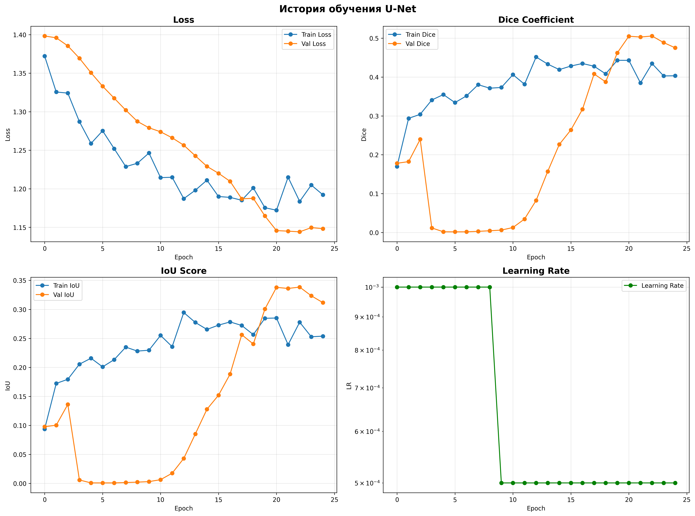
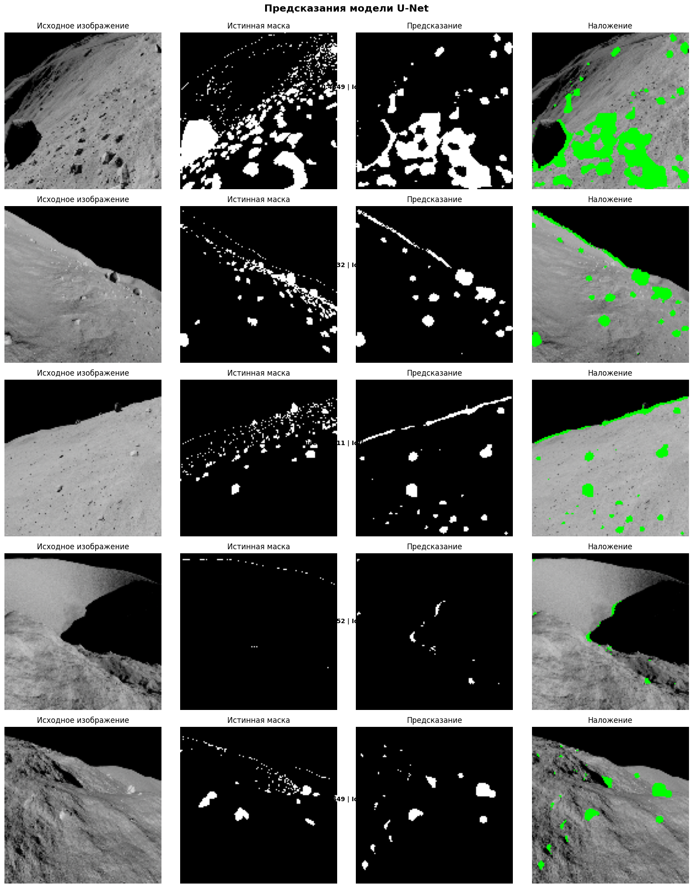

# Отчёт по ДЗ №3: Классификация и сегментация изображений

## Введение

### Цель работы
Разработка и сравнение моделей глубокого обучения для двух ключевых задач компьютерного зрения: **классификации изображений** и **семантической сегментации**. Проект включает создание собственной архитектуры классификатора и исследование эффективности U-Net архитектур для задач сегментации.

### Задачи проекта
1. **Классификация**: Создание CNN архитектуры для классификации изображений Tiny ImageNet-200
2. **Сегментация**: Реализация U-Net для бинарной сегментации лунной поверхности
3. **Интеграция**: Комбинирование лучших подходов из обеих задач

### Используемые данные
- **Классификация**: Tiny ImageNet-200 (200 классов, 100k изображений)
- **Сегментация**: MOON_SEGMENTATION_BINARY (изображения и бинарные маски)

---

# Часть 1. Классификатор 128×128

### Описание эксперимента
Для задачи классификации была разработана собственная архитектура **SimpleNetEncoder**, вдохновленная принципами ResNet с использованием bottleneck-блоков. Модель обучалась на изображениях, приведенных к разрешению 128×128 пикселей, с применением аугментаций для улучшения обобщающей способности.

`./training_results/1.Classification/SimpleNetEncoder/best_model.pth` - лучшая модель по результатам тренировки 

**Рисунок 1: График обучения модели**

*График показывает динамику функции потерь и точности на тренировочной и валидационной выборках в процессе обучения*

### Архитектура SimpleNetEncoder

#### Обзор модели
Облегченный энкодер в стиле ResNet для классификации изображений, использующий ботлнек-блоки для эффективного извлечения иерархических признаков из RGB изображений 128×128.

#### Обработка входных данных
- **Вход**: 128×128×3 (RGB изображение)
- **Начальная свертка**: 3×3 conv → 16 каналов, сохраняет пространственные размеры

#### Пайплайн обработки ботлнек-блоками
| Стадия | Входные каналы | Ботлнек | Выходные каналы | Разрешение | Операция |
|--------|----------------|---------|-----------------|------------|-----------|
| 0 | 3 | - | 16 | 128×128 | Начальная свертка |
| 1 | 16 | 8 | 32 | 64×64 | Ботлнек + уменьшение |
| 2 | 32 | 16 | 64 | 32×32 | Ботлнек + уменьшение |
| 3 | 64 | 32 | 128 | 16×16 | Ботлнек + уменьшение |
| 4 | 128 | 64 | 256 | 8×8 | Ботлнек + уменьшение |

#### Структура ботлнек-блока
Каждый блок выполняет:
1. **1×1 сжатие**: Уменьшает размерность каналов
2. **3×3 пространственная обработка**: Извлечение признаков с опциональным страйдом
3. **1×1 расширение**: Восстанавливает размерность каналов
4. **Residual соединение**: Сохраняет информацию через skip-connections

#### Классификационная головка
- **Global Average Pooling**: 8×8×256 → 256 признаков
- **Полносвязный слой**: 256 → 4 выходных класса

### Конечный результат на тестовом датасете

#### Матрица ошибок

**Таблица 1: Нормализованная матрица ошибок (%)**
| Фактический \ Предсказанный | Guacamole (0) | Ice Lolly (1) | Meat Loaf (2) | Lakeside (3) |
|-----------------------------|---------------|---------------|---------------|--------------|
| **Guacamole (0)**           | 74.0%         | 4.0%          | 20.0%         | 2.0%         |
| **Ice Lolly (1)**           | 2.0%          | 78.0%         | 10.0%         | 10.0%        |
| **Meat Loaf (2)**           | 4.0%          | 4.0%          | 92.0%         | 0.0%         |
| **Lakeside (3)**            | 4.0%          | 0.0%          | 4.0%          | 92.0%        |

#### Метрики качества по классам

**Таблица 2: Детальные метрики классификации**
| Класс                      | Точность | Полнота | F1-score |
|----------------------------|----------|---------|-----------|
| **Guacamole (0)**          | 0.88     | 0.74    | 0.80      |
| **Ice Lolly (1)**          | 0.91     | 0.78    | 0.84      |
| **Meat Loaf (2)**          | 0.73     | 0.92    | 0.81      |
| **Lakeside (3)**           | 0.88     | 0.92    | 0.90      |
| **Общая**                  | **0.84** | **0.84**| **0.84**  |

---

# Часть 2. U-Net 
*Архитектура и результаты базовой реализации U-Net для задачи сегментации* 

- Базовые каналы на первом уровне: 16 (т.к. начиная с большего числа каналов - увеличивалось число параметров, выходящее за ограничение до 2.5 М)  

- Даунсемплинг: stride 2 или MaxPool.  

- Итоговый слой: 1 канал с сигмоидой (бинарная сегментация).  

Ограничение на количество параметров: до ~2.5M (рекомендуется укладываться, но допускается ±10%).  

Вход: 128×128×3.  

Цель сегментации - сегментировать изображение с помощью маски, где 1 - есть камень, 0 нет.

Итоговая loss-функция была скомбинирована BCE и Dice loss, где веса при соотвествующих метриках были 0.5 и 1.25.

Пример того, как выглядит выход из обученной модели 
  

Итоговые лучшие метрики на валидации по Dice:

    `Val   - Loss: 1.1441, Dice: 0.5057, IoU: 0.3384, Acc: 0.9041`

`./training_results/2.Segmentation/Baseline/best_moon_unet.pth` - лучшая модель по результатам тренировки 

---

# Часть 3. U-Net со своим Encoder из части 1
В этой части необходимо было совместить классификатор из ч.1 как бэкбон для u-net из ч.2. Причем необходимо провести 2 эскперимента:

- **option A**
    Взять предобученную модель из части 1 и заморозить веса на энкодере. В эпохах обновлять веса лишь у декодера. 

Визуализация процесса обучения

[Вариант А](<training_results/2.Segmentation/option A/train_and_valid_plot.png>)  

На 4ой картинке внизу видно, что L Rate был 0, что соотвествует логике эксперимента, веса энкодера - не обновлялись с момента обучения, как в части 1.  

Итоговые лучшие метрики на валидации по Dice:
    `Val   - Loss: 1.2685, Dice: 0.3606, IoU: 0.2200, Acc: 0.7293`

- **option B**
    Взять предобученную модель из части 1 и разморозить обновление весов на энкодере на последних эпохах. 

    Визуализация процесса обучения

[Вариант Б](<training_results/2.Segmentation/option B/train_and_valid_plot.png>) 

Итоговые лучшие метрики на валидации по Dice:
    `Val   - Loss: 0.4537, Dice: 0.4125, IoU: 0.2598, Acc: 0.8848`  

## Визуальное сопоставление результатов

### Вариант А
[Вариант А](<training_results/2.Segmentation/option A/output.png>) 

Широкие захваты камней (широкие зеленые маски, показывают, что модель не была настроена на предсказание камней - от слова совсем, что соотвествует логике эксперимента.)  

### Вариант B
[Вариант Б](<training_results/2.Segmentation/option B/output.png>)  

Здесь ситуация лучше. Все еще низкое качество, но предсказания становятся более точными. 

## Сравнение результатов сегментации

| Модель       | Loss    | Dice Coefficient | IoU (Jaccard) | Accuracy |
|--------------|---------|------------------|---------------|----------|
| **Baseline** | 1.1441  | **0.5057**       | **0.3384**    | **0.9041** |
| **Option A** | 1.2685  | 0.3606           | 0.2200        | 0.7293   |
| **Option B** | **0.4537** | 0.4125         | 0.2598        | 0.8848   |

Ситуация вышла неодназначной, ясно, что Baseline имеет лучшую ситуацию по Dice, однако по Accuracy сомнительный результат, который можно подставить под сомнение (1.2 п.п.), возможно, если найти лучшую комбинацию, когда нужно обновлять веса модели в варианте B, то можно придти к решению, что сможет превзойти Baseline не только по скомбинированному Loss значению.

